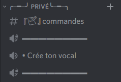

# Nymeria_vocal


# Description

Bot discord fait pour gérer les channels *crée ton vocal :*



# Commandes


| Commandes  | Description  |
| :---------------: |:---------------:|
| n!voice lock | Empeche plus de personnes de rejoindre le vocal |
| n!voice unlock | Ouvre ton salon pour que d'autres puissent rejoindre |
| n!voice name *nomduchannel* | Change le nom du vocal |
| n!voice limit *nombre* | Fixe une limite du nombre d'utilisateurs maximal pouvant rejoindre le vocal |
| n!voice permit *@utilisateur* | Permets à un utilisateur particulier de rejoindre le vocal |
| n!voice reject *@utilisateur* | Empêche un utilisateur de rejoindre votre salon et l'expulse s'il y est déjà |
| n!voice claim | Permets de s'approprier le salon vocal si son créateur l'a quitté |

# Configuration

```Toml
[bot]
bot = true
token = "XXXXXXXXXXXXXXXXXXXXXXXXXXXXXXXXXXXX"
json_data_base = "XXX"

[servers]

    [servers.staf]
        id = "XXXXXXXXXXXXXXXXXX"
        cat = "XXXXXXXXXXXXXXXXXX"
        channels_bloque = "XXXXXXXXXXXXXXXXXX XXXXXXXXXXXXXXXXXX"
        channel_creation = "XXXXXXXXXXXXXXXXXX"
```


#### Configuration d'un server:

```toml
[bot]
bot = "self bot ou pas"
token = "token"
json_data_base = "chemain vers le fichier json déjà crée"

[servers."nom"]
    id = "id du serveur"
    cat = "catégorie contenant le catégorie du channel crée ton vocal"
    channels_bloque = "channels qui ne doivent pas être suprimé dans la catégorie"
    channel_creation = "channel crée ton vocal"
```